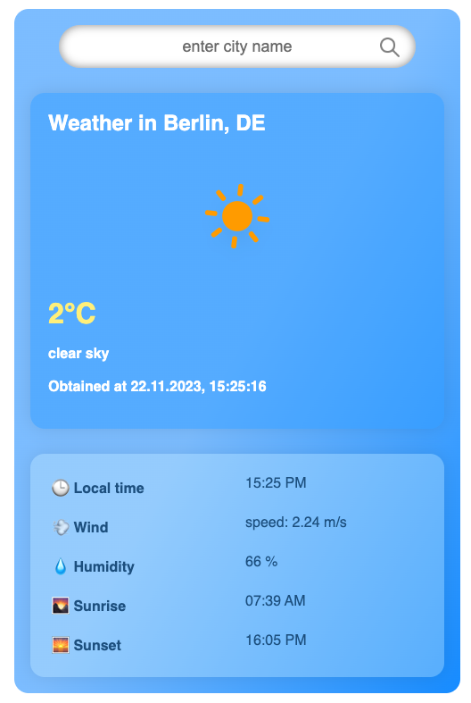
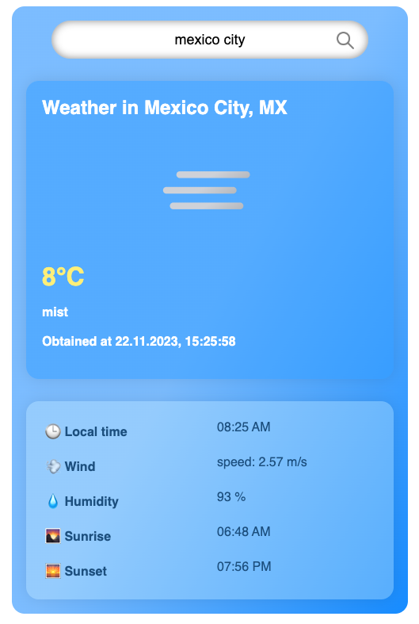
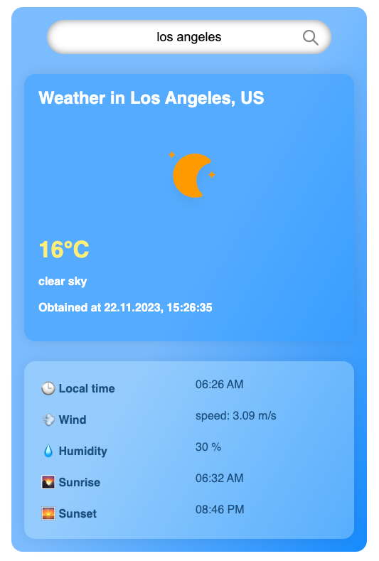

# the weather app

## an API and GIT Group-Project

- This project was created as part of a coding bootcamp.
- we worked in a group of two
- The learning objective of the project was to work with GIT (git workflow) as a team, to internalize the use of APIs and API Keys and to strengthen our skills in project planning and project documentation. We presented our results to our course.
- The task: create a weather app using the OpenWeatherAPI.
- time given: 1.5 days
- What the weather app should be able to do, which values should be displayed and how the design should be implemented was up to us.

## How our weather app works:

- Dynamic and clear display of the current weather at a location determined by the user (which can be specified via an input field)
- animated icons from "amCharts" and "basmilius" implemented in the code also dynamically adapt to the weather at the location specified by the user. This gives the user an even better overview of the current weather
- In addition to the current temperature, the weather app provides the user with information about the cloud situation, wind speed, humidity, local time and the local sunrise and sunset time at the location specified by the user.

## Demo

https://cecilestaller.github.io/js-weatherAPI-project/

## weather app Screenshots

## Tech Stack

- HTML5
- SCSS
- JavaScript
- PAP (Excalidraw)
- SCRUM (Trello)
- RESTful API (OpenWeatherAPI)
- GIT
- GitHub
- Discord

## Authors

- [@YacineYldrm](https://github.com/YacineYldrm)
- [@cecilestaller](https://github.com/cecilestaller)
